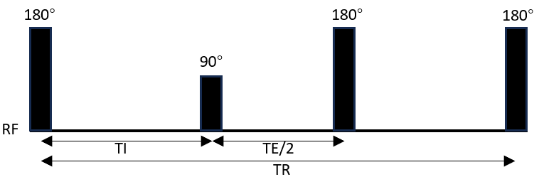
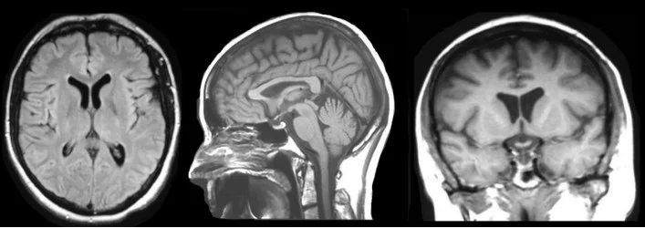

# FLAIR: Fluid-attenuated inversion recovery

**1. Principle:**

FLAIR is a sequence with an inversion recovery pulse set to null the fluid signals, especially that from the cerebrospinal fluids (CSF). By suppressing CSF, it could help to visualize the periventricular hyperintense lesions, such as multiple sclerosis.

  

figure 1. Sequence diagram of FLAIR 

  
The inversion time (TI) could be selected to suppress signals from any tissue based on the corresponding T1: TI=ln(2)×𝑇1

  

figure 2. Sample images from T1, T 2, AND FLAIR modalities 1 

  

**2. Common diagnosis:**

Aging, arteriolosclerosis, multiple sclerosis, etc.
  

**References:**

1. Madhuranthakam A J, Sarkar S N, Busse R F, et al. Optimized double inversion recovery for reduction of T1 weighting in fluid‐attenuated inversion recovery. Magnetic Resonance in Medicine, 2012, 67(1): 81-88.
